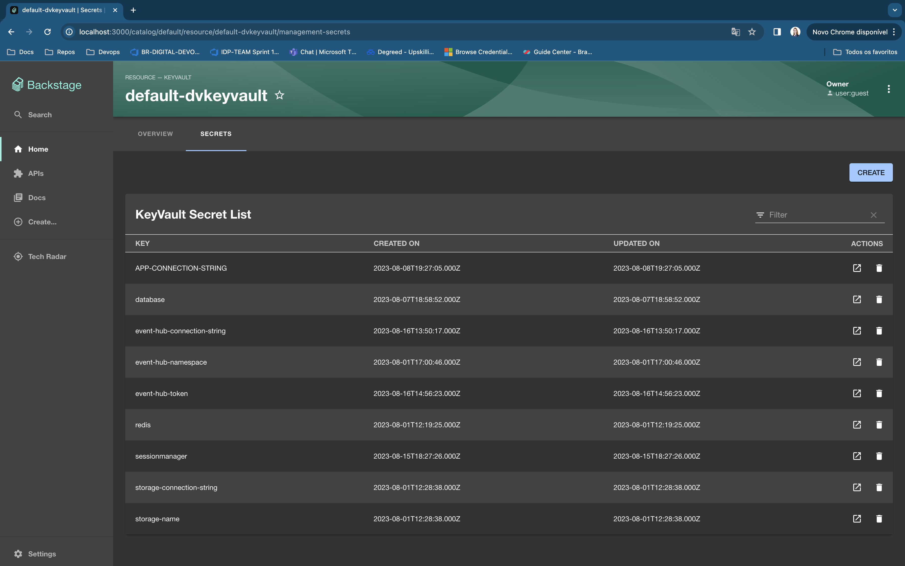
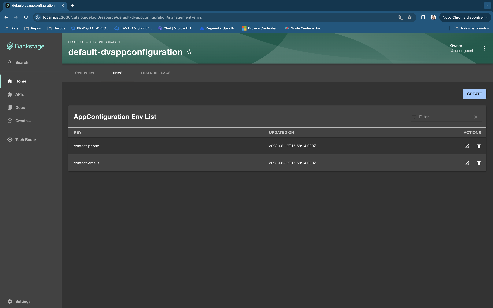
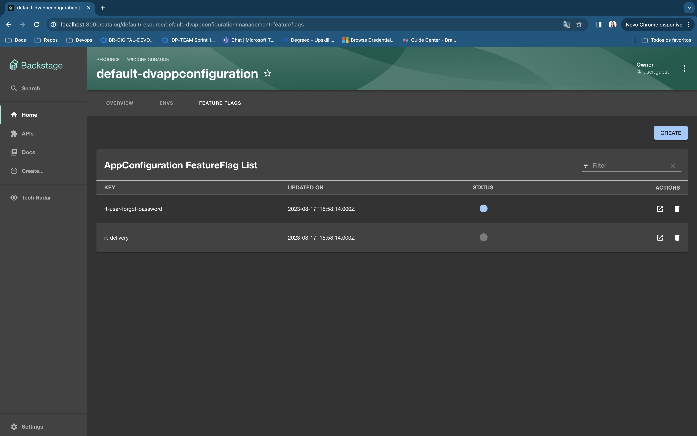

# management-configs

Welcome to the management-configs plugin!

_This plugin was created through the Backstage CLI_

This plugin provides the front-end for managing the configurations of your applications that are in the cloud or in some other service in your on-premise environment. The plugin includes tabs for listing, creating, editing, and deleting feature flags, environments (envs), and secrets.

Simply follow the contract and implement the backend locally. You can see an example of backend implementation [here](../management-configs-backend/src/service/router.ts).

## Getting Started

### Install the package

```bash
# From your Backstage root directory
yarn --cwd packages/app add @fbertoni/plugin-management-configs
```

### Add the plugin to `packages/app/src/components/catalog/EntityPage.tsx`

Import the `ManagementConfigsContent` component and the `ConfigType` to define what type of configuration should be displayed.

```bash
import { ManagementConfigsContent, ConfigType } from '@internal/plugin-management-configs';
```

In the `entityPage`, create an `EntityLayout.Route` with the `path` and `title` of the tab you want to display your configuration, and inside it, add the `ManagementConfigsContent` component with the desired `type`.

For example, in the case below, only for resources of type Keyvault, I would like to display the Secrets tab, and for the AppConfiguration type, I want to display two tabs, one for Environments (Envs) and another for Feature Flags:

```diff
// packages/app/src/components/catalog/EntityPage.tsx
import {
  EntityAboutCard,
  EntityDependsOnComponentsCard,
  EntityDependsOnResourcesCard,
  EntityHasComponentsCard,
  EntityHasResourcesCard,
  EntityHasSubcomponentsCard,
  EntityHasSystemsCard,
  EntityLayout,
  EntityLinksCard,
  EntitySwitch,
  EntityOrphanWarning,
  EntityProcessingErrorsPanel,
  isComponentType,
  isKind,
  hasCatalogProcessingErrors,
  isOrphan,
  hasRelationWarnings,
  EntityRelationWarning,
+ isResourceType,
} from '@backstage/plugin-catalog';

+ import { ManagementConfigsContent, ConfigType } from '@internal/plugin-management-configs';

…

+ const resourcePage = (
+   <EntityLayout>
+     <EntityLayout.Route path="/" title="Overview">
+       {overviewContent}
+     </EntityLayout.Route>
+ 
+     <EntityLayout.Route if={isResourceType('keyvault')} path="/management-secrets" title="Secrets">
+       <ManagementConfigsContent title="Secret List" type={ConfigType.Secret} />
+     </EntityLayout.Route>
+ 
+     <EntityLayout.Route if={isResourceType('appconfiguration')} path="/management-envs" title="Envs">
+       <ManagementConfigsContent title="Env List" type={ConfigType.Env} />
+     </EntityLayout.Route>
+ 
+     <EntityLayout.Route if={isResourceType('appconfiguration')} path="/management-featureflags" title="Feature Flags">
+       <ManagementConfigsContent title="FeatureFlag List" type={ConfigType.FeatureFlag} />
+     </EntityLayout.Route>
+   </EntityLayout>
+ );

export const entityPage = (
  <EntitySwitch>
    <EntitySwitch.Case if={isKind('component')} children={componentPage} />
    <EntitySwitch.Case if={isKind('api')} children={apiPage} />
    <EntitySwitch.Case if={isKind('group')} children={groupPage} />
    <EntitySwitch.Case if={isKind('user')} children={userPage} />
    <EntitySwitch.Case if={isKind('system')} children={systemPage} />
    <EntitySwitch.Case if={isKind('domain')} children={domainPage} />
+   <EntitySwitch.Case if={isKind('resource')} children={resourcePage} />

    <EntitySwitch.Case>{defaultEntityPage}</EntitySwitch.Case>
  </EntitySwitch>
);

```

Resulting in the following layout:






## Permissions

This plugin implements permissions defined in the plugin-management-configs-common. They are:

| Name   | Description |
|--------|-------|
| manegementconfigs.envs.create  | used to display or hide the "Create" button for the "Env" type |
| manegementconfigs.envs.delete  | used to display or hide the trash can icon in the actions column of the table for the "Env" type |
| manegementconfigs.featureflag.create  | used to display or hide the "Create" button for the "FeatureFlag" type |
| manegementconfigs.featureflag.delete  | used to display or hide the trash can icon in the actions column of the table for the "FeatureFlag" type |
| manegementconfigs.secrets.create  | used to display or hide the "Create" button for the "Secret" type |
| manegementconfigs.secrets.delete  | used to display or hide the trash can icon in the actions column of the table for the "Scret" type |

If you are creating your own backend, it is advisable to use permissions in the backend routes as well.
And to enable the tab for each config, it is recommended to use the read permission in the `packages/app/src/components/catalog/EntityPage.tsx` file, as in this [example](../../packages/app/src/components/catalog/EntityPage.tsx)

## Development

Your plugin has been added to the example app in this repository, meaning you'll be able to access it by running `yarn start` in the root directory, and then navigating to [/management-configs](http://localhost:3000/management-configs).

You can also serve the plugin in isolation by running `yarn start` in the plugin directory.
This method of serving the plugin provides quicker iteration speed and a faster startup and hot reloads.
It is only meant for local development, and the setup for it can be found inside the [/dev](./dev) directory.
